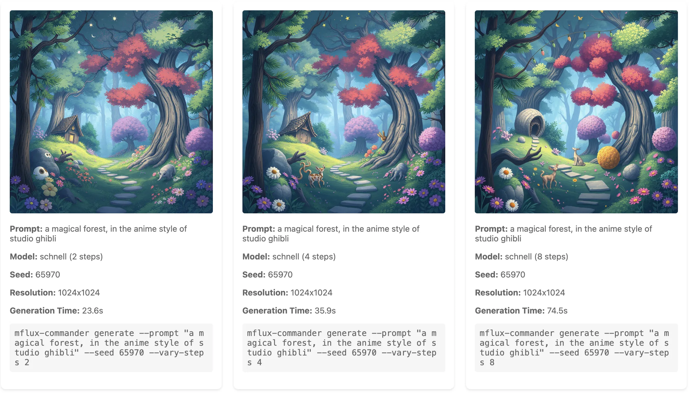

# MFlux Commander

Use flux models on your Apple Silcon machine.

[filipstrand/mflux](https://github.com/filipstrand/mflux) is a A MLX port of FLUX based on the Huggingface Diffusers implementation, and `mflux-commander` is tool that lets you manage all of the parameters, so you can do things like this:

```
./mflux-wrapper.py --prompt "a magical forest" --iterations 3
```


And you can change one parameter and see a couple more variations

```
mflux-wrapper.py --style ghibli
```


And if you like what you see, you can see interations of a specific seed variant:

```
./mflux-wrapper.py --seed 185769 --vary-steps 1,3,5,9
```



## Overview

MFlux Commander is a CLI tool for working directly with image generation models, designed for both local development and direct model exploration. Unlike polished products like Midjourney, it provides raw access to the underlying model capabilities, making it invaluable for understanding model behavior and prototyping new features.

A key feature is the ability to control the number of inference steps - from quick 1-step previews that generate in seconds to detailed 9-step renders that can take minutes. This granular control lets you rapidly prototype ideas with fast previews, then refine promising directions with higher-quality renders. The tool's session management and live preview features make it feel like a proper development environment, while its command-line interface and detailed logging support automation and systematic experimentation.

A powerful command-line tool for managing and exploring image generation with mflux-generate. Features include:

- Running multiple iterations with random or fixed seeds
- Automatic session management and history tracking
- Real-time progress monitoring with live preview
- Detailed metadata tracking and command reproduction
- Style management and reuse
- Interactive HTML galleries for reviewing results
- Seed and step variation modes for exploring different parameters

## Example Sessions

### Basic Image Generation

Generate 4 iterations of an image using the default settings:

```bash
./mflux-wrapper.py --prompt "a serene lake at sunset"
```

This will:

1. Create a new session directory or use a recent one
2. Generate 4 iterations with random seeds
3. Open a live preview in your browser
4. Save all results with metadata
5. Create an interactive HTML gallery

### Style Exploration

Save and apply styles to maintain consistency:

```bash
# Save a style
./mflux-wrapper.py --save-style ghibli "in the style of Studio Ghibli, hand-drawn animation"

# List available styles
./mflux-wrapper.py --list-styles

# Apply a style
./mflux-wrapper.py --prompt "a magical forest" --style ghibli
```

### Iterative Refinement

Explore variations of seeds and steps:

```bash
# Generate iterations with different step counts but same seed
./mflux-wrapper.py --prompt "a cyberpunk city" --seed 12345 --vary-steps 1,3,5,9

# Generate iterations with different random seeds
./mflux-wrapper.py --prompt "a cyberpunk city" --vary-seed --iterations 4

# Refine a specific result
./mflux-wrapper.py --prompt "a cyberpunk city" --seed 12345 --steps 5
```

### Resolution Experiments

Try different aspect ratios and sizes:

```bash
# Quick preview with small format
./mflux-wrapper.py --prompt "mountain range" --landscape-sm

# Landscape format
./mflux-wrapper.py --prompt "mountain range" --landscape-xl

# Portrait format
./mflux-wrapper.py --prompt "tall tree in forest" --portrait-lg

# Custom resolution
./mflux-wrapper.py --prompt "city skyline" --resolution 1920x1080
```

## Command Reference

### Core Options

- `--prompt TEXT` - The generation prompt (reuses last prompt if not specified)
- `--model [schnell|dev]` - Model to use (default: schnell)
- `--new` - Force creation of new output directory
- `--no-watch` - Disable live preview
- `--iterations N` - Number of iterations to generate (default: 4)
- `--vary-seed` - Generate variations using different random seeds
- `--seed N` - Starting seed (random if not provided, cannot be used with --vary-seed)
- `--steps N` - Number of steps (defaults: 1 for schnell, 5 for dev)
- `--metadata` - Include generation metadata in output

### Resolution Options

Standard Formats:

- `--resolution WxH` - Custom resolution (default: 1024x1024)
- `--landscape` - 16:9 format (1024x576)
- `--portrait` - 3:4 format (768x1024)

Small Formats:

- `--landscape-sm` - Small 16:9 (512x288)
- `--portrait-sm` - Small 3:4 (384x512)
- `--square-sm` - Small square (512x512)

Large Formats:

- `--landscape-lg` - Large 16:9 (1536x864)
- `--portrait-lg` - Large 3:4 (1152x1536)

Extra Large Formats:

- `--landscape-xl` - XL 16:9 (2048x1152)
- `--portrait-xl` - XL 3:4 (1536x2048)
- `--square-xl` - XL square (2048x2048)

### Style Management

- `--save-style NAME DESC` - Save a new style
- `--list-styles` - Show all saved styles
- `--style NAME` - Apply a saved style
- `--style none` - Clear any existing style

### Advanced Features

- `--vary-steps N,N,N` - Comma-separated list of step counts to iterate through (requires --seed)
- `--output-dir DIR` - Custom output directory
- `--metadata` - Include metadata in output

## Output Structure

Each session creates a directory with format `mflux_output_YYYYMMDD_HHMMSS` containing:

- `index.html` - Main gallery of all runs
- `run_N/` - Directories for each generation run
  - `index.html` - Detailed view of the run
  - `image_N.png` - Generated images
  - `image_N.png.json` - Metadata (if enabled)
  - `run_info.json` - Run configuration and results

The tool automatically manages sessions, keeping related generations together and making it easy to track and reproduce results.

## Future actions

- [ ] Image to image
- [ ] Lora models
- [ ] Training your own model

## Installation

Clone this repository and ensure the script has executable permissions:

```bash
git clone https://github.com/yourusername/mflux-wrapper.git
cd mflux-wrapper
chmod +x mflux-wrapper.py
```

## Requirements

- Python 3.6+
- `mflux` - `uv tool install -p 3.12 --upgrade mflux`
- `mflux-generate` command installed and in your PATH
- Optional: `live-server` (install with `npm install -g live-server`) for live preview

## License

MIT
