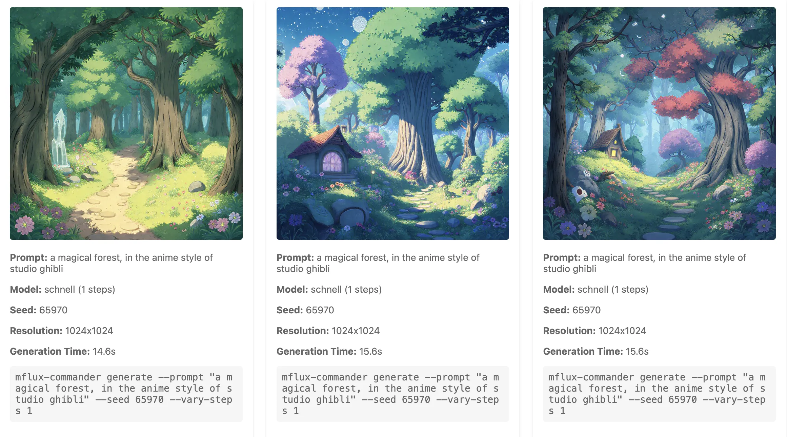

# MFlux Commander

Use flux models on your Apple Silicon machine.

[filipstrand/mflux](https://github.com/filipstrand/mflux) is a MLX port of FLUX based on the Huggingface Diffusers implementation, and `mflux-commander` is a tool that lets you manage all of the parameters for image generation.

## Quick Start

```bash
# Install mflux and mflux-commander
uv tool install -p 3.12 --upgrade mflux
pip install mflux-commander

# Generate an image with default settings
mflux-commander generate --prompt "a magical forest"

# Generate multiple variations with different seeds
mflux-commander generate --prompt "a magical forest" --vary-seed 3

# Apply a style
mflux-commander generate --prompt "a magical forest" --style ghibli

# Generate variations with different step counts
mflux-commander generate --prompt "a magical forest" --seed 185769 --vary-steps 1,3,5,9

# Get creative prompt suggestions
mflux-commander brainstorm "homegrown software"
```

A prompt with random seeds will look like this:


You can apply a pre-determined style like `--style ghibli`



And you can run iterations over the number of steps to flesh out the image more:


## Overview

MFlux Commander is a CLI tool for working directly with image generation models, designed for both local development and direct model exploration. Unlike polished products like Midjourney, it provides raw access to the underlying model capabilities, making it invaluable for understanding model behavior and prototyping new features.

Key features include:

- Control over inference steps (1-step previews to 9-step detailed renders)
- Session management and live preview
- Detailed logging for automation and experimentation
- Seed variations for exploring different outputs
- Step variations for understanding model behavior
- Style management and reuse
- Interactive HTML galleries
- Prompt brainstorming with AI assistance

## Command Reference

### Basic Generation

```bash
# Basic image generation
mflux-commander generate --prompt "your prompt"

# Generate multiple variations with different seeds
mflux-commander generate --prompt "your prompt" --vary-seed 4

# Use a specific seed
mflux-commander generate --prompt "your prompt" --seed 12345

# Different model
mflux-commander generate --prompt "your prompt" --model dev
```

### Resolution Options

Available formats:

- `--format landscape` - 16:9 format (1024x576)
- `--format portrait` - 3:4 format (768x1024)
- `--format landscape_sm` - Small 16:9 (512x288)
- `--format portrait_sm` - Small 3:4 (384x512)
- `--format landscape_lg` - Large 16:9 (1536x864)
- `--format portrait_lg` - Large 3:4 (1152x1536)

Default is square 1024x1024.

### Style Management

```bash
# Save a new style
mflux-commander save-style "cyberpunk" "neon-lit, cybernetic, high-tech, dystopian future"

# List available styles
mflux-commander list-styles

# Use a style
mflux-commander generate --prompt "city street" --style cyberpunk
```

You'll need to come up with your own. Here are a few of mine:

```
Available Styles:
----------------------------------------
blueprint: structural drawings, line drawings, white background, minimalist, construction drawings
charcoal: as a charcoal drawing
cyberpunk: neon-lit, cybernetic, high-tech, dystopian future
ghibli: in the anime style of studio ghibli
retro: 35mm fuji film 1970s photograph distressed and faded
----------------------------------------
```

### Advanced Features

Seed and Step Variations:

```bash
# Generate variations with different random seeds
mflux-commander generate --prompt "your prompt" --vary-seed 4

# Generate variations with different step counts
mflux-commander generate --prompt "your prompt" --seed 12345 --vary-steps 1,3,5,9
```

Brainstorming:

```bash
# Generate creative prompt variations
mflux-commander brainstorm "concept"
```

Note: Brainstorming requires the `ANTHROPIC_API_KEY` environment variable to be set.

Session Management:

```bash
# Force new session
mflux-commander generate --prompt "your prompt" --force-new-session
```

## Output Structure

Each session creates a directory with format `mflux_output_YYYYMMDD_HHMMSS` containing:

```
mflux_output_YYYYMMDD_HHMMSS/
├── index.html                 # Main gallery
├── brainstorm_results.json    # Brainstorming results (if used)
└── run_N/                     # Run directories
    ├── index.html            # Run gallery
    ├── image_*.png           # Generated images
    ├── metadata.json         # Per-image metadata
    └── run_info.json         # Run configuration and results
```

Sessions are maintained for 4 hours before creating a new one, or you can force a new session with `--force-new-session`.

## Installation

```bash
# Install mflux
uv tool install -p 3.12 --upgrade mflux

# Install mflux-commander
pip install mflux-commander
```

### Requirements

- Python 3.8+
- MLX (Apple Silicon only)

## Development

```bash
# Clone repository
git clone https://github.com/wschenk/mflux-commander
cd mflux-commander

# Install development dependencies
pip install -e ".[dev]"

# Run tests
pytest
```

## Future Features

- [ ] Image to image generation
- [ ] Lora model support
- [ ] Custom model training

## License

MIT
